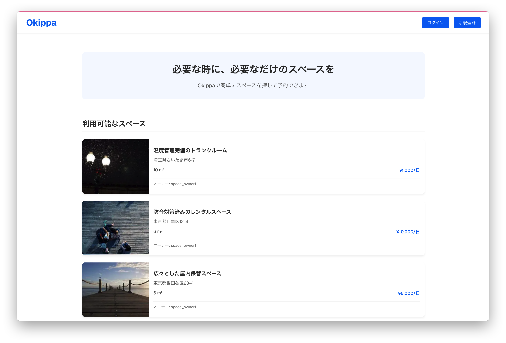
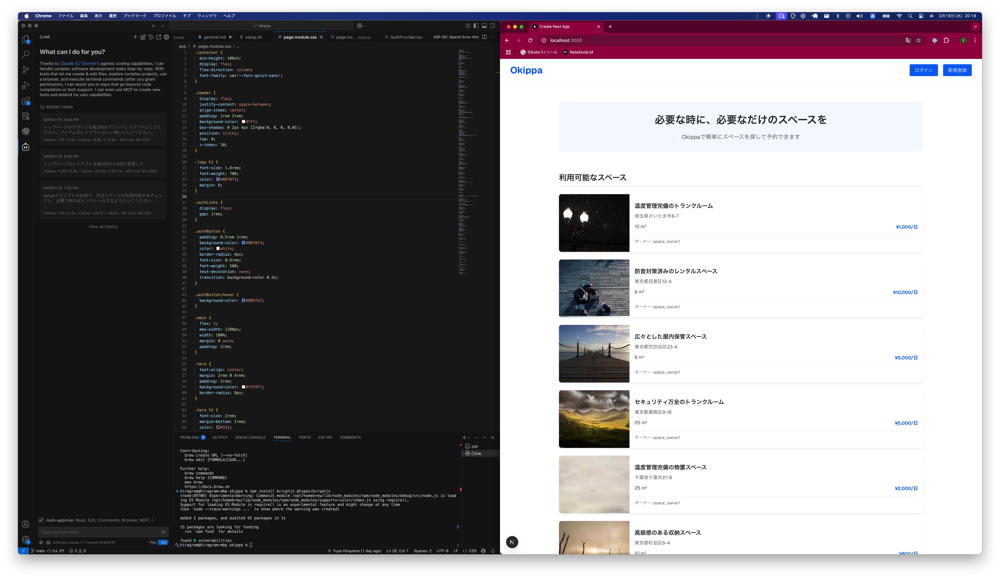
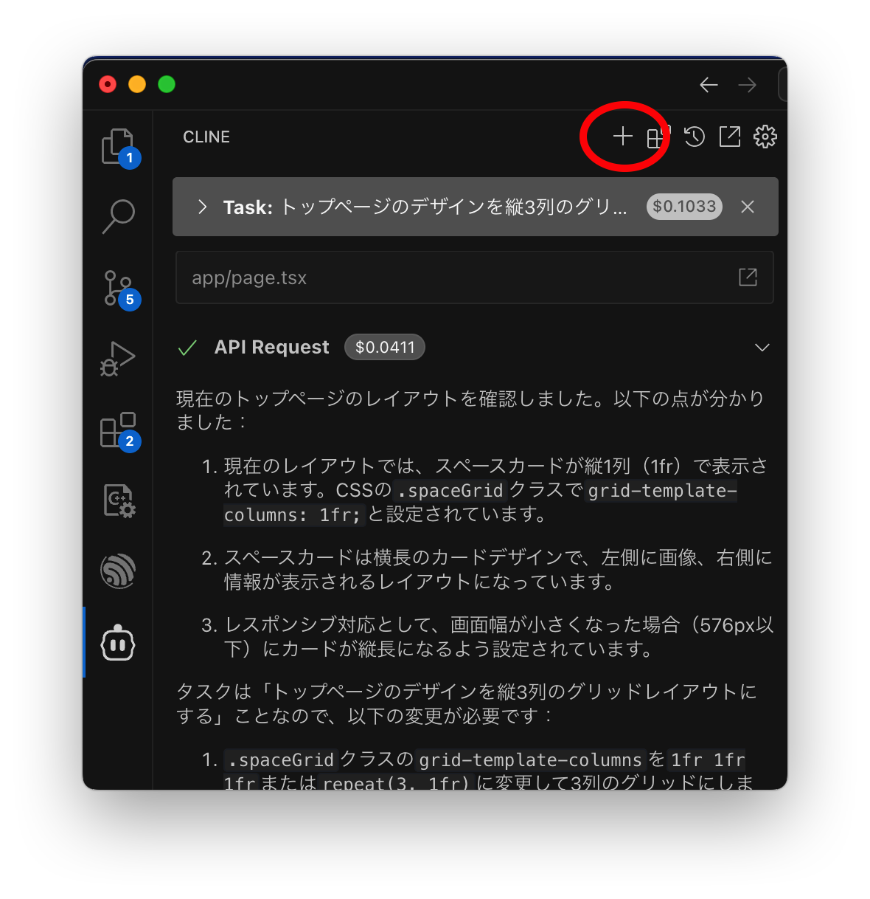

# シナリオ

それでは実際にAIエージェントを活用してWebアプリケーションの開発に取り組みましょう。

最初に、このハンズオンで扱うプロジェクトについて紹介します。

Okippaは、空いている物置を他の人に貸し出すことで収益を得られるシェアリングサービスです。途中まで開発していたエンジニアが退職してしまい、事業責任者であるあなたが開発を引き継がなければなりません。

まずはAIエージェントへの指示出しを練習しましょう。

ブラウザで http://localhost:3000 を開いてください。Okippaのサービスが表示されますか？もしこの時点でOkippaのページが開けない場合は助けを求めてください。



AIが加えたコードへの変更は、リアルタイムにブラウザに反映されます。もしディスプレイに余裕があれば、このようにVSCodeとブラウザを左右に並べておくと、アプリケーションの変化がわかりやすいです。



さて、今のトップページには隙間が多く、なんだかさみしい印象です。AIにもっと華やかな見た目に変更してもらいましょう。

Clineの上部にある `+` ボタンを押して、新規タスクを作ります。(Clineでは、違うことをやらせるときには新規タスクとして指示をだします。タスクが完了したあとに追加で関連した作業をさせる場合は、引き続き同じチャットで続けて対話することができますが、今回は先ほどやったプロジェクト初期化とは別の作業ですので、新規タスクを開始しました。)



Clineに、次のように指示してみてください。

```
トップページのデザインを縦3列のグリッドレイアウトにしてください。各アイテムのデザインはグリッドレイアウトに適したものにしてください。
```

画面に変化はありましたか？もっと凝ったデザインを思いつくかもしれませんが、一旦ここまでにしましょう。

練習は以上です。いよいよOkippaの開発を始めましょう。

---

→ [セクション1](./section1.md)
