# 環境構築

## VSCodeでサンプルアプリを開くまで

<details>
<summary>エンジニア向けはこちら</summary>

- https://github.com/hiragram/okippa をcloneしてVSCodeで開いてください

</details>

---

<details>
<summary>エンジニアじゃない人向けはこちら</summary>

## サンプルアプリを取得

- https://github.com/hiragram/okippa を開く
- 下の画像を参考に、zipファイルをダウンロードする
- ダウンロードしたzipファイルを展開する
- 展開してできたフォルダを後で使います。

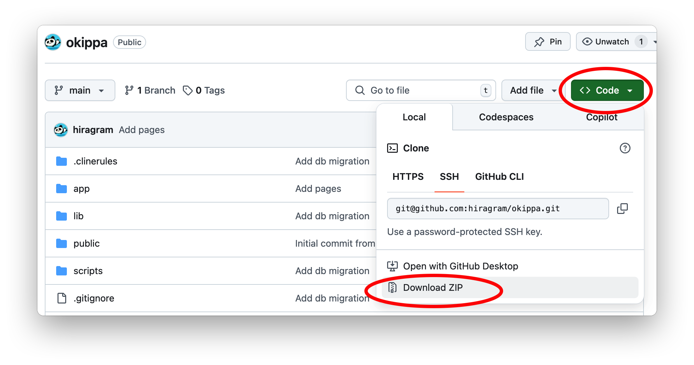

## Visual Studio Code をセットアップ

### インストール

Visual Studio Code(以下: VSCode)は、広く利用されている統合開発環境です。

以下の公式サイトからダウンロード、インストールしてください。

https://code.visualstudio.com/

### ワークスペースを開く

- VSCodeを開く
- メニューで "File" -> "Open Folder..."で、さっき展開したサンプルアプリのフォルダを開く

赤丸をクリックしてこんな感じでファイル一覧が見れてればOK。

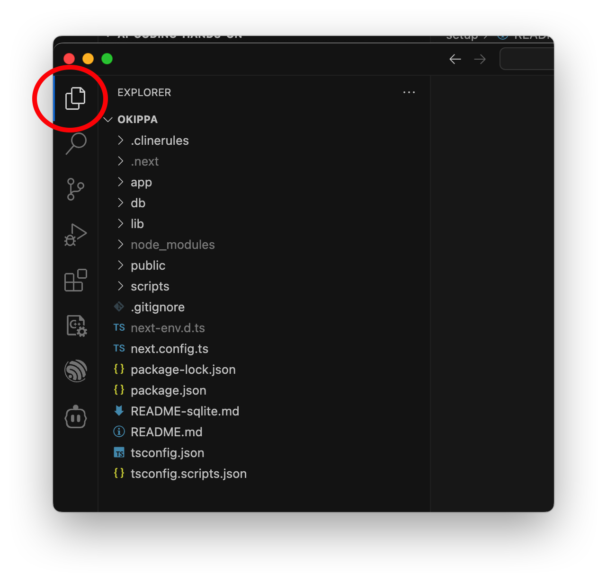

</details>

## Clineをインストール

ClineというAIエージェントをインストールします。ClineはVSCodeの拡張機能として動作し、ユーザーに変わってファイルを操作したりコマンドを実行したりします。

- インストールページを開く
  - https://marketplace.visualstudio.com/items?itemName=saoudrizwan.claude-dev
- Install を押すとVSCodeで拡張機能のページが開かれるので、インストールする
- VSCodeを再起動しろと言われたら、する

## AnthropicのAPIキーを取得する

Anthropicは、ClaudeというAIを開発する企業です(ChatGPTを作るOpenAIの競合です)。

2025年3月現在、自律的にコーディングを行うAIのモデルとしてはAnthropic社が提供する、Claude 3.7 Sonnetというやつが最強とされています。今回のハンズオンではこのモデルを使うために、AnthropicのAPIキーを作成します。

- Anthropic Consoleのアカウントを作る
    - https://console.anthropic.com/login
    - ログインページに見えるけどサインアップもできる
- Anthropicに残高を追加する
    - https://console.anthropic.com/settings/billing
    - Buy creditsをクリック
    - 5ドル分のクレジットを購入する

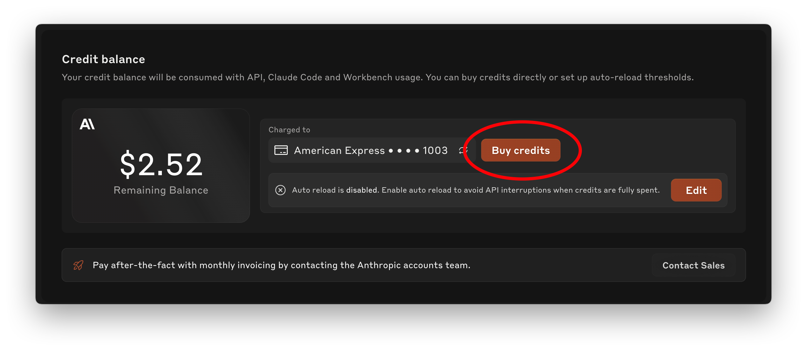
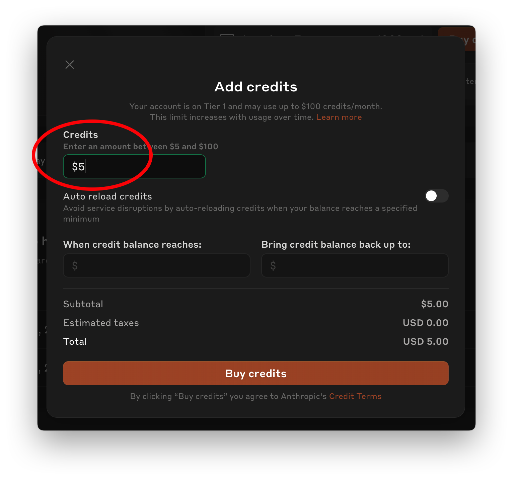

- APIキーを作成する
    - https://console.anthropic.com/settings/keys
    - Create API Keyからキーを作成
    - Workspaceはデフォルト、名前は適当に。
    - APIキーが表示されたら、一旦ストップ。閉じるともう見れないのでこのまま。

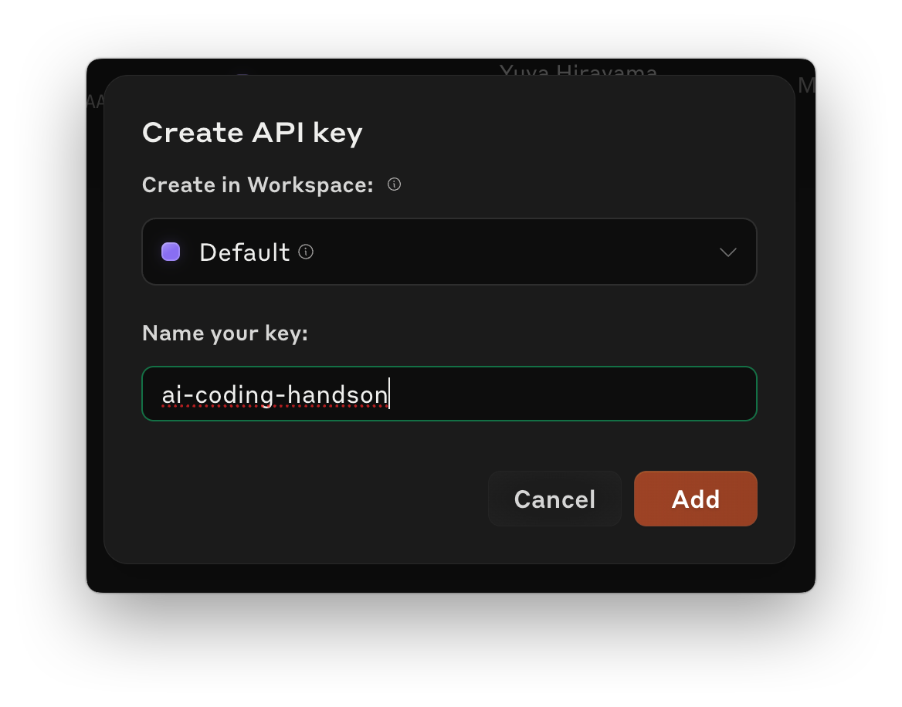

## Clineの設定

### モデル、APIキーの設定

Clineの設定画面を開きます。

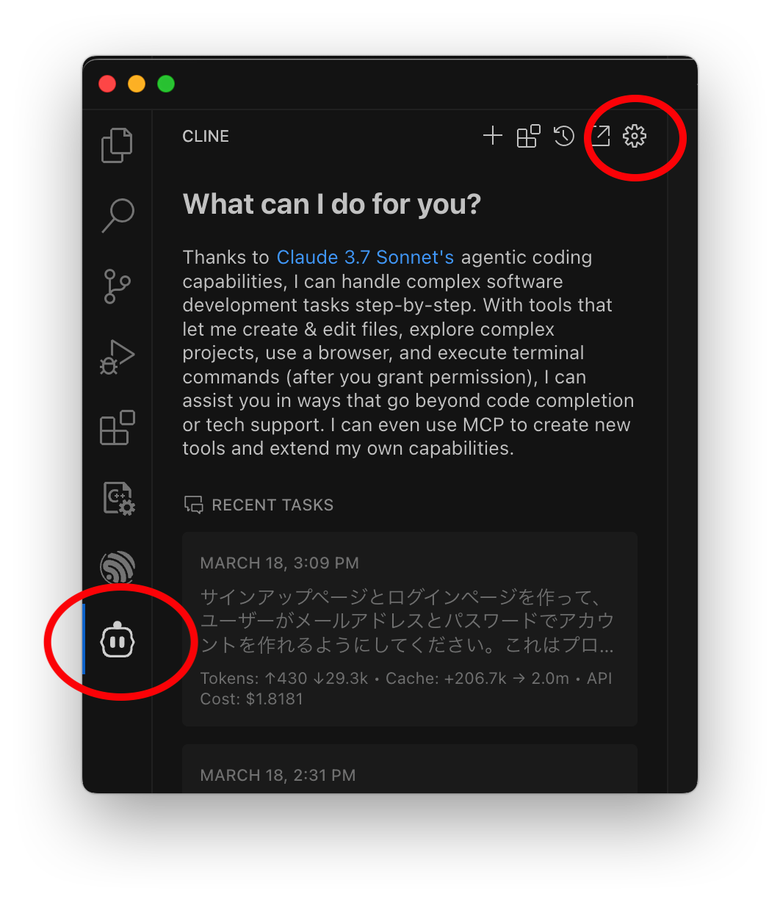

画像を参考に、以下のように設定します。

- API Provider: Anthropic
- Anthropic API Key: 先ほど作ったAPIキー
- Use custom base URL: オフ
- Model: claude-3-7-sonnet-20250219
- Enable extended thinking: オン
- Use different models for Plan and Act modes: オフ
- Allow anonymous error and usage reporting: オフ

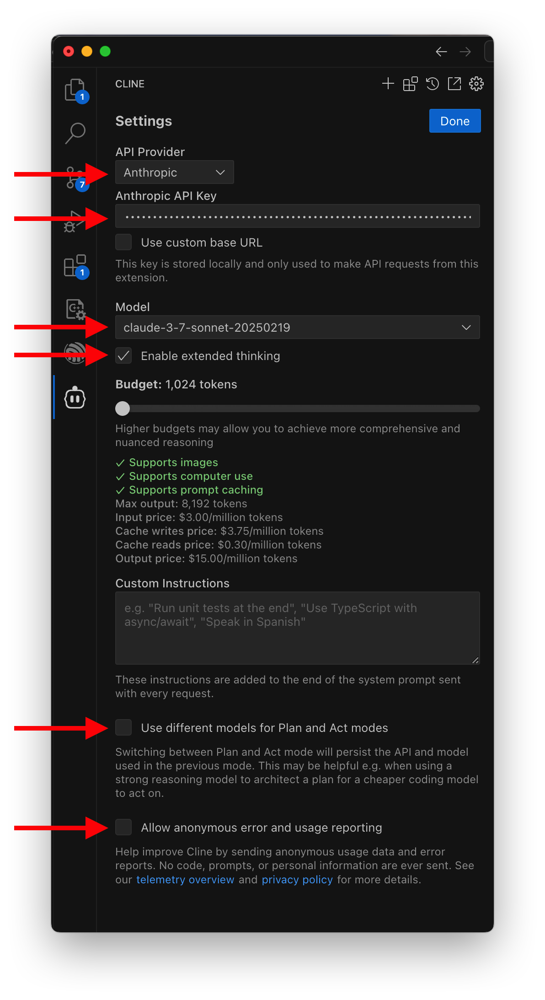

### Auto approveの設定

画像を参考にAuto approve設定を開きます。

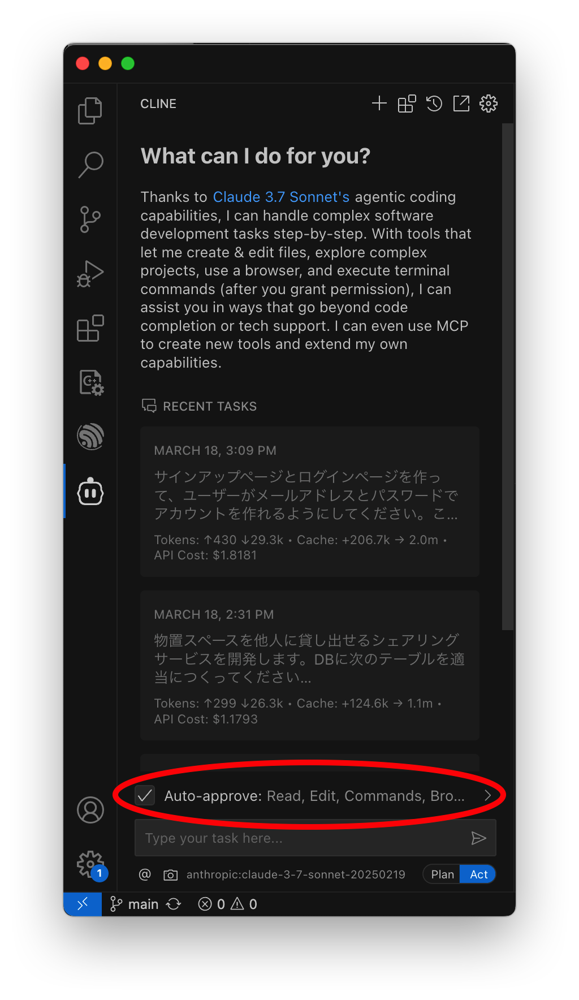

画像の通りに設定します。

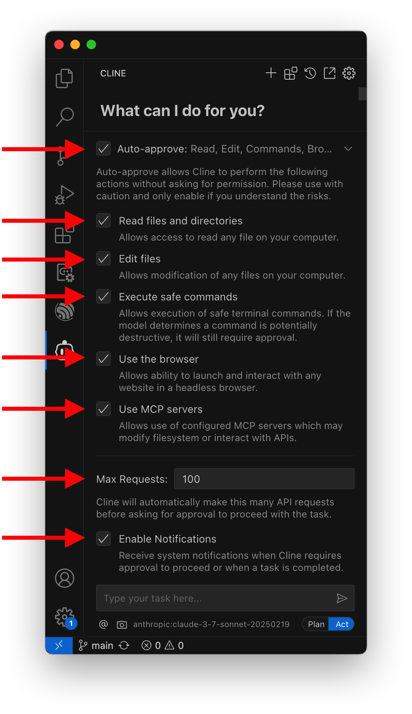

## プロジェクトの初期化

最後に、ちょっとだけAIを使ってみましょう！

エンジニアではない人の場合は、開発に必要なツールがインストールされておらず、エラーが発生するかもしれません。しかしAIは、自律的にエラーの内容を読み取り、不足しているものを理解し、それをインストールしてくれるので安心してください。

### Homebrewについて先に説明

ただし1つだけ。プロジェクトの初期化の過程で、Homebrewというツールをインストールするよう言われます(ちなみに、エンジニアのMacには当たり前にインストールされているものです)。

Homebrewのインストールは、AIだけではできず、人間のアクションが必要です。

- Macのログインパスワードを入力する
  - `Password: ` に続けてパスワードを入力しますが、セキュリティ上画面には表示されません。実際はちゃんと入力されているので、入力後Enterを押して続行してください。

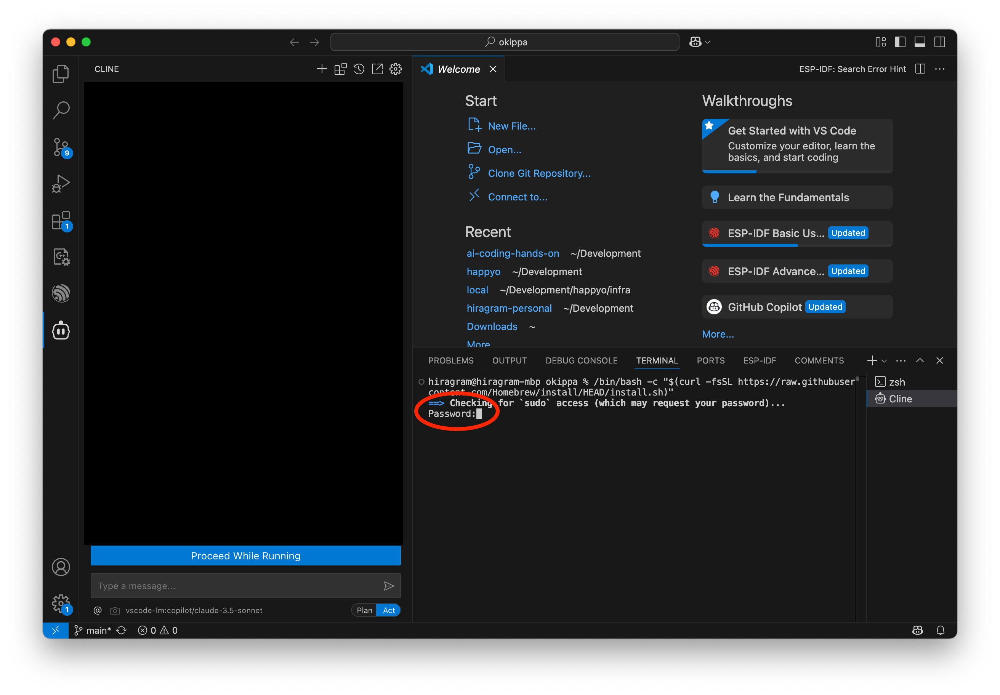

- 確認画面でEnterキーを押してインストールを実行する
  - Enter以外のキーを押すと中止されてしまうので注意

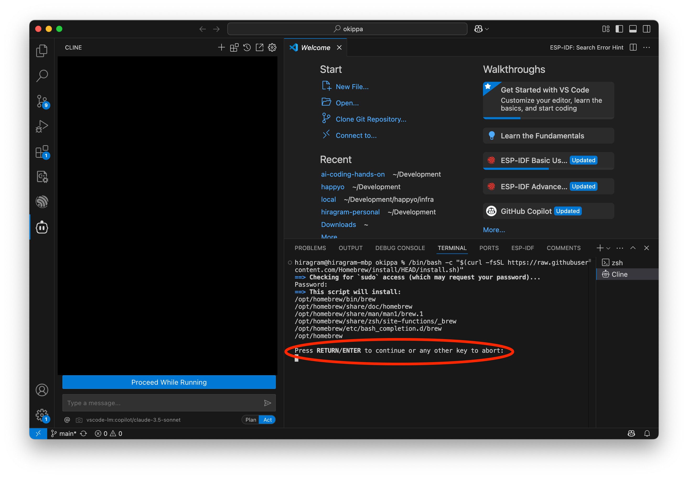

### 実際にAIにプロジェクトを初期化してもらう

画像で示す入力欄を使って、AIエージェントとやり取りをします。

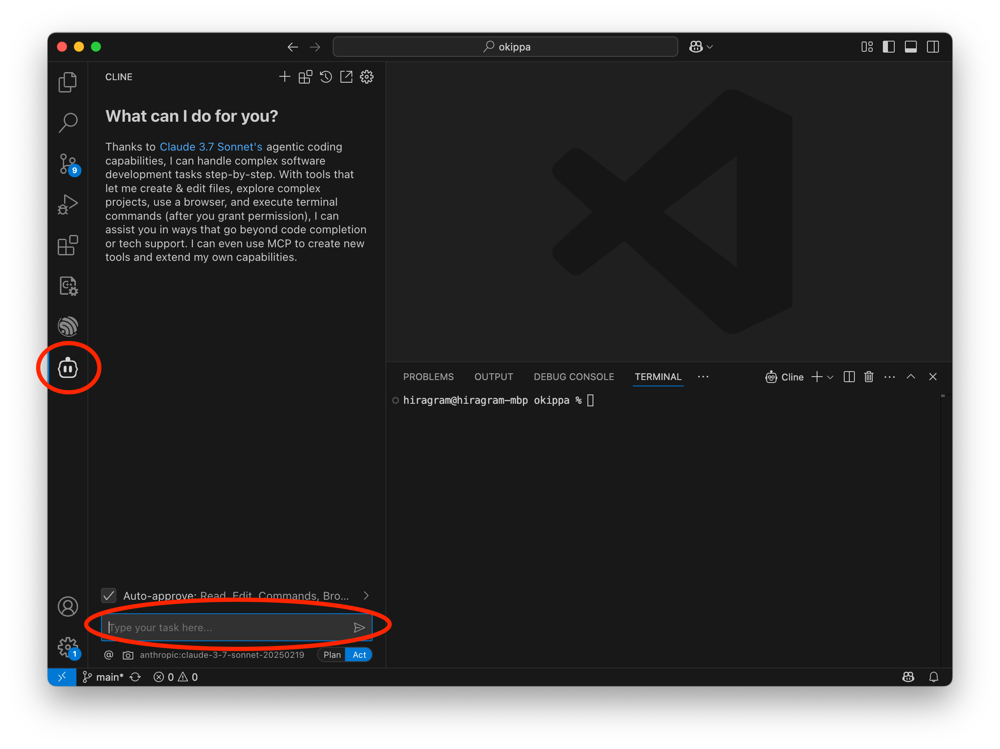

ここに、次のような指示を出してみましょう。

```
プロジェクトをセットアップして。
```

すると、このようにターミナル上でコマンドが実行され、タスクが完了したことを報告してきます。もしここで成功しなかったら声かけてください。

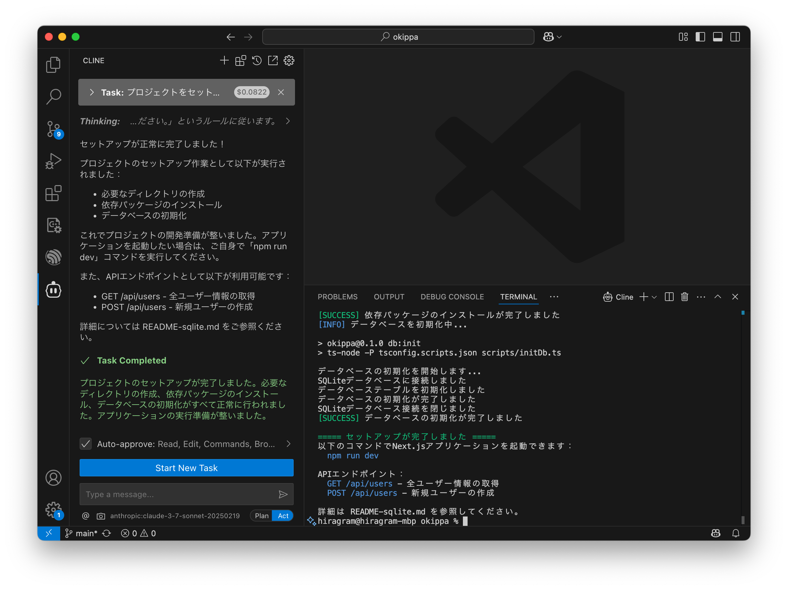

これで環境構築は完了です！